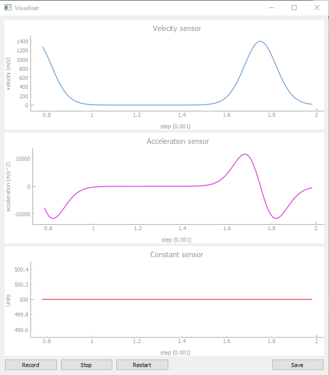

# Exercise 2 - Programming a data visualisation tool

## Overview

I chose to interpret the function as a imaginary sensor that returns a value for a given time step t. In my code, I therefore have a `Sensor` object that returns data for time step t based on the lambda function it is initialised with. Such an approach allows the user to easily visualise any type of function, not just the one given in the exercise. Thanks to the modular nature of the visualiser, it is capable to visualise many functions at a time. Simply add a sensor to the `sensors` list that the `Visualise` object is initialised with. 

In the application, it is also possible to start, stop and restart a recording of data. This data can then be saved to a csv file.

## Usage

Install dependencies:
`pip install -r requiremets.txt`

Run visualiser
`python visualiser.py`

Run tests
`pytest`

## Issues

There is currently an issue with the test runner on Github. In order to run the tests, or run pyqt for that matter, the machine has to have a monitor. Since the github actions runner does not have a monitor, pyqt aborts and the tests fail. I did not have time to fix this issue before the deadline but it can most likely be solved with Xvfb (http://elementalselenium.com/tips/38-headless.)